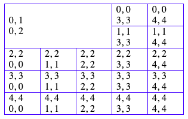

# table-editor


Web table editor

### Usage
````
import {TableEditor} from 'web-table-editor';

// create instance
const te = new TableEditor({...});
// event listener
te.addEventListener('load', () => {});
// destroy
te.destroy();
````

### Row Index & Column Index
````
{start row index}, {end row index}
{start column index}, {end column index}
````


### Constructor options

 Name                     | Type                    | Attributes  | Description
--------------------------|-------------------------|-------------|-------------
elem                      | HTMLElement             |             | Table container element
data                      | TableData, TableCells   |             | Table data
defaultColWidth           | number                  | <optional\> | Default column width for cells those do not have width property. The default is 0.
fullWidth                 | boolean                 | <optional\> | The table size is 100% or not. The default is false
editable                  | boolean                 | <optional\> | Table is editable or not. The default is true.
cellFocusedBackground     | string                  | <optional\> | Background of cell which is focused. The default is transparent.
borderColor               | string                  | <optional\> | Border color of cell.
debug                     | boolean                 | <optional\> | Debug switch. The default is false.

### Methods

* `addRow(rowIdx: number, above: boolean): boolean`
* `delRow(rowIdx: number): boolean`
* `addColumn(colIdx: number, left: boolean): boolean`
* `delColumn(colIdx: number): boolean`
* `mergeCells(rowRange: TdRange, colRange: TdRange): boolean`
* `splitCell(rowIdx: number, colIdx: number, rowCount: number, colCount: number): boolean`
* `getCellContent(rowIdx: number, colIdx: number): string`
* `setCellContent(rowIdx: number, colIdx: number, content: string): boolean`
* `undo(): boolean`
* `redo(): boolean`
* `getTableData(): { rows: Array<Array<object>>, colWidth: Array<number> }`
* `setEditable(editable: boolean)`
* `addEventListener(name: string, handler: Function)`
* `removeEventListener(name: string, handler: Function)`
* `destroy()`


### Event Listeners

Name         | Callback param       | Description
-------------|----------------------|-------------
cellfocus    | TECellFocusEvent     | Cell focused
cellblur     | TECellBlurEvent      | Cell blur 
mousemove    | TEMouseMoveEvent     | Mouse move

### Type Definitions

````
type TdRange = [number, number];

type TdData = {
    row: TdRange;
    col: TdRange;
    content: string;
    style?: object
    width?: number
}

type TrData = Array<TdData>

type TableData = Array<TrData>

type TableCells = Array<TdData>;

class TECellFocusEvent {
    row: TdRange;
    col: TdRange;
}

class TECellBlurEvent {
    row: TdRange;
    col: TdRange;
}
class TEMouseMoveEvent {
    offsetX: number;
    offsetY: number;
}
````

### Todo
* Select cells by drag
